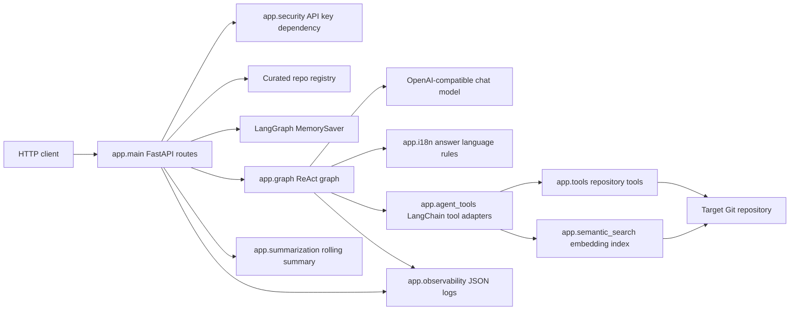
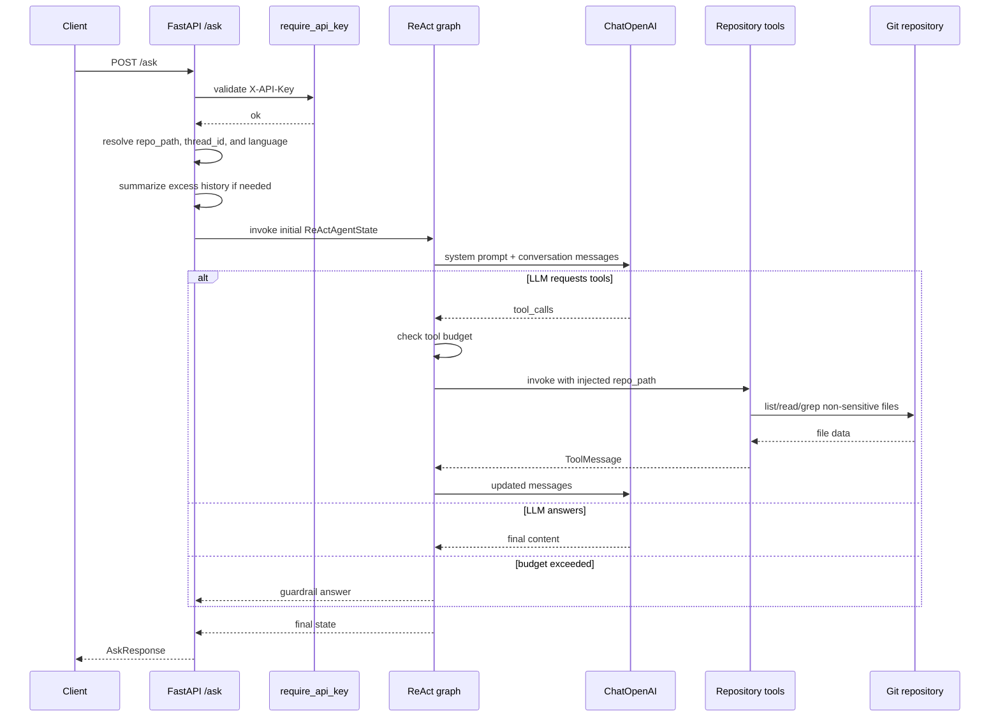
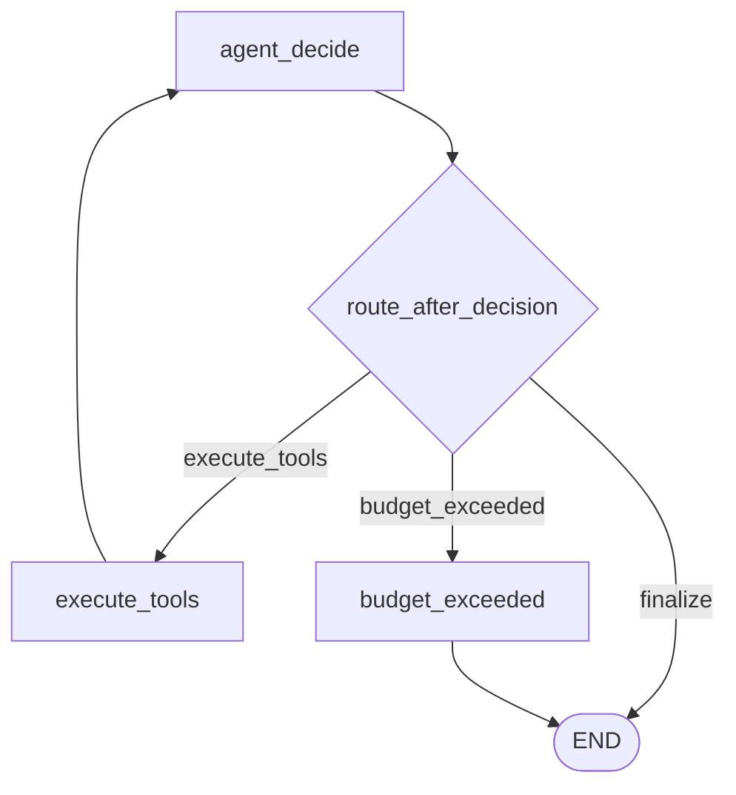

# Architecture

Overture is a small layered FastAPI application around a LangGraph ReAct agent.
It is not a strict Clean Architecture or Hexagonal Architecture implementation:
the API layer composes settings, repository provisioning, graph invocation, and
response mapping directly. The modules are still separated enough to identify
clear responsibilities.

## Components

## Module Responsibilities

| Module | Responsibility |
| --- | --- |
| `app.main` | FastAPI app, startup lifecycle, route handlers, request logging, thread and repo selection. |
| `app.config` | Pydantic settings with `APP_` environment prefix. |
| `app.graph` | ReAct graph, legacy deterministic graph, LLM creation, language-aware prompt/fallbacks, tool execution, budget guardrail. |
| `app.i18n` | Supported answer languages and localized canned responses. |
| `app.agent_tools` | LangChain tool wrappers exposed to the LLM. |
| `app.tools` | Filesystem-safe repository inspection functions. |
| `app.semantic_search` | Optional lazy per-repo embedding index and cosine-similarity search. |
| `app.summarization` | Rolling summary builder for messages removed from thread history. |
| `app.repo` | Default and curated repo materialization by shallow clone or existing path. |
| `app.portfolio` | Optional YAML parsing and `repo_id` validation for curated repos. |
| `app.security` | Static API key dependency. |
| `app.observability` | JSON log formatter, request correlation, content clipping. |
| `app.schemas` | Pydantic request/response models and trajectory models. |

## Request Lifecycle

## ReAct Graph

`build_react_graph()` compiles a `StateGraph` with three nodes:

- `agent_decide`: calls the LLM with tools bound and either records a final answer or stores tool calls in messages.
- `execute_tools`: runs requested tools from `get_tool_registry()`, injects `repo_path`, records `ToolMessage`s and trajectory.
- `budget_exceeded`: stops execution when a requested tool batch would exceed `APP_MAX_ITERATIONS`.

Edges:

The prompt instructs the model to read implementation files before answering
behavior questions. `grep_repo` is treated as a locator, not as enough evidence for
behavioral claims.

When `APP_SEMANTIC_SEARCH_ENABLED=true`, the prompt also describes
`semantic_search`. The addendum tells the model to use it only to locate candidate
files when lexical search misses, then call `read_file` to confirm behavior.

Every `/ask` request also adds an answer-language instruction from `app.i18n`.
Supported values are `pt-BR` and `en`; missing values default to `pt-BR`. This
affects the final answer and canned graph fallbacks, but not internal logs or HTTP
error details.

## State

`ReActAgentState` includes:

- `user_input`;
- `repo_path`;
- optional per-request `language`, defaulting to `pt-BR` when absent;
- LangGraph `messages`;
- `final_answer`;
- `outcome`;
- optional `conversation_summary`, injected into the system prompt when present;
- `trajectory`;
- cumulative `iterations`;
- optional `turn_start_iterations`, used so the tool budget resets per question even when conversation memory persists.

`app.main.ask` summarizes old thread messages before removing them when history
exceeds `APP_MAX_HISTORY_MESSAGES`. The updated summary is stored in graph state.
If summarization fails, the messages are still removed and the request continues.

## Repository Tools

Tools operate on a target repo path selected by the API layer:

- `list_files(repo_path)`: lists non-sensitive files while skipping ignored directories.
- `read_file(repo_path, relative_path)`: resolves paths inside repo bounds, rejects sensitive/binary/non-file targets, and truncates after 300 lines.
- `grep_repo(repo_path, term, max_results=20)`: exact substring search over visible text files, truncating matching lines at 200 characters.
- `semantic_search(query, repo_path)`: optional meaning-based lookup over eligible
  files, returning ranked file paths, scores, and 200-character snippets.

The LLM sees file/search arguments, but not `repo_path`. `repo_path` is an injected
argument in `app.agent_tools` and is added by `execute_tools_node`.

## Semantic Search

Semantic search is off by default. When enabled, `get_llm_tools()` and
`get_tool_registry()` add `semantic_search`.

Implementation characteristics:

- whole-file embeddings, not chunked function-level embeddings;
- same sensitive-path and binary-file filtering as the other repository tools;
- lazy index build on the first semantic search per `repo_path`;
- process-local cache guarded by locks to avoid duplicate first-use embedding calls;
- cosine similarity ranking with `top_k=3` by default;
- graceful degradation to an empty result if embedding/index/search fails.

## Legacy Deterministic Graph

`build_graph()` remains in `app.graph` for study and regression tests. It classifies
questions into `structural`, `specific_code`, `dependencies`, or `unknown`, then
runs one deterministic repository tool before generating an answer. It is not the
runtime path used by `/ask`.

## Architectural Trade-offs

| Decision | Benefit | Cost |
| --- | --- | --- |
| ReAct loop instead of one-shot retrieval | Lets the model inspect files iteratively and read implementations. | Quality depends on model tool-calling behavior. |
| Feature-flagged `semantic_search` | Helps locate files for conceptual questions with weak lexical overlap. | Adds embedding cost, process-local cache, and provider dependency. |
| Per-request answer language | Lets the frontend switch between `pt-BR` and `en` without separate endpoints or resetting memory. | Internal prompts/errors remain English; unsupported languages are rejected at validation. |
| In-memory `MemorySaver` plus rolling summaries | Keeps follow-ups useful while bounding message history. | Conversations and embedding indexes disappear on restart or scale-to-zero. |
| Curated repo YAML | Fits portfolio use case and avoids request-time arbitrary URL surface. | Does not satisfy arbitrary repo registration use cases. |
| Static API key | Cheap token-spend protection. | No per-client identity, rotation workflow, or rate limiting. |

## Boundaries and Risks

- The API layer owns repository selection and passes `repo_path` through graph state.
- The graph owns LLM/tool orchestration, not HTTP status mapping.
- Tool functions own filesystem guardrails.
- There is no persistent database, queue, tracing backend, or metrics backend.
- Semantic indexes are in-memory only and are rebuilt after process restart.
- `thread_id` and `repo_id` are not cross-validated, so a conversation can switch repos mid-thread.
