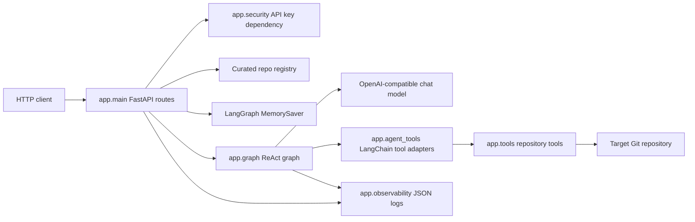
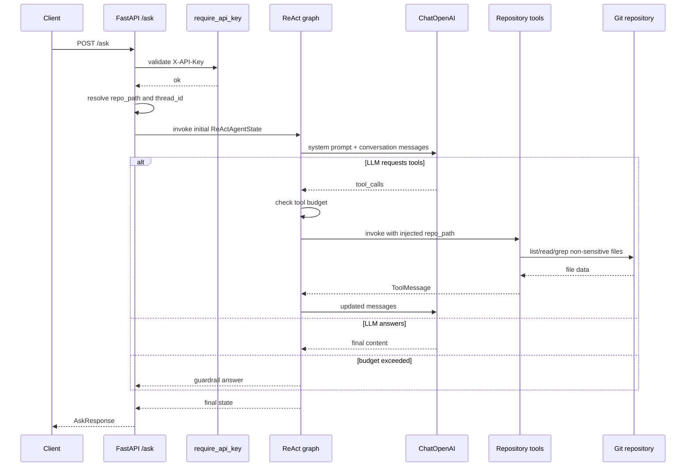

# Architecture

Overture is a small layered FastAPI application around a LangGraph ReAct agent.
It is not a strict Clean Architecture or Hexagonal Architecture implementation:
the API layer composes settings, repository provisioning, graph invocation, and
response mapping directly. The modules are still separated enough to identify
clear responsibilities.

## Components

## Module Responsibilities

| Module | Responsibility |
| --- | --- |
| `app.main` | FastAPI app, startup lifecycle, route handlers, request logging, thread and repo selection. |
| `app.config` | Pydantic settings with `APP_` environment prefix. |
| `app.graph` | ReAct graph, legacy deterministic graph, LLM creation, tool execution, budget guardrail. |
| `app.agent_tools` | LangChain tool wrappers exposed to the LLM. |
| `app.tools` | Filesystem-safe repository inspection functions. |
| `app.repo` | Default and curated repo materialization by shallow clone or existing path. |
| `app.portfolio` | Optional YAML parsing and `repo_id` validation for curated repos. |
| `app.security` | Static API key dependency. |
| `app.observability` | JSON log formatter, request correlation, content clipping. |
| `app.schemas` | Pydantic request/response models and trajectory models. |

## Request Lifecycle

## ReAct Graph

`build_react_graph()` compiles a `StateGraph` with three nodes:

- `agent_decide`: calls the LLM with tools bound and either records a final answer or stores tool calls in messages.
- `execute_tools`: runs requested tools from `get_tool_registry()`, injects `repo_path`, records `ToolMessage`s and trajectory.
- `budget_exceeded`: stops execution when a requested tool batch would exceed `APP_MAX_ITERATIONS`.

Edges:

The prompt instructs the model to read implementation files before answering
behavior questions. `grep_repo` is treated as a locator, not as enough evidence for
behavioral claims.

## State

`ReActAgentState` includes:

- `user_input`;
- `repo_path`;
- LangGraph `messages`;
- `final_answer`;
- `outcome`;
- `trajectory`;
- cumulative `iterations`;
- optional `turn_start_iterations`, used so the tool budget resets per question even when conversation memory persists.

`app.main.ask` trims old thread messages before invoking the graph when history
exceeds `APP_MAX_HISTORY_MESSAGES`.

## Repository Tools

Tools operate on a target repo path selected by the API layer:

- `list_files(repo_path)`: lists non-sensitive files while skipping ignored directories.
- `read_file(repo_path, relative_path)`: resolves paths inside repo bounds, rejects sensitive/binary/non-file targets, and truncates after 300 lines.
- `grep_repo(repo_path, term, max_results=20)`: exact substring search over visible text files, truncating matching lines at 200 characters.

The LLM sees `relative_path` and `term` arguments, but not `repo_path`. `repo_path`
is an injected argument in `app.agent_tools` and is added by `execute_tools_node`.

## Legacy Deterministic Graph

`build_graph()` remains in `app.graph` for study and regression tests. It classifies
questions into `structural`, `specific_code`, `dependencies`, or `unknown`, then
runs one deterministic repository tool before generating an answer. It is not the
runtime path used by `/ask`.

## Architectural Trade-offs

| Decision | Benefit | Cost |
| --- | --- | --- |
| ReAct loop instead of one-shot retrieval | Lets the model inspect files iteratively and read implementations. | Quality depends on model tool-calling behavior. |
| Exact `grep_repo` instead of semantic search | Simple, transparent, cheap, deterministic. | Conceptual questions with weak lexical overlap can miss relevant files. |
| In-memory `MemorySaver` | Small scope and easy to test. | Conversations disappear on restart or scale-to-zero. |
| Curated repo YAML | Fits portfolio use case and avoids request-time arbitrary URL surface. | Does not satisfy arbitrary repo registration use cases. |
| Static API key | Cheap token-spend protection. | No per-client identity, rotation workflow, or rate limiting. |

## Boundaries and Risks

- The API layer owns repository selection and passes `repo_path` through graph state.
- The graph owns LLM/tool orchestration, not HTTP status mapping.
- Tool functions own filesystem guardrails.
- There is no persistent database, queue, cache, vector index, tracing backend, or metrics backend.
- `thread_id` and `repo_id` are not cross-validated, so a conversation can switch repos mid-thread.
