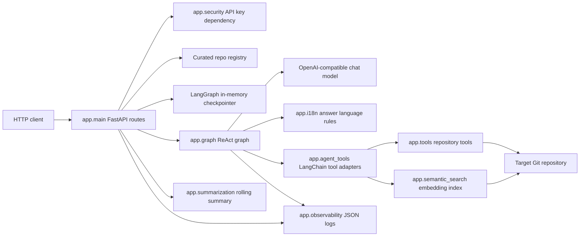
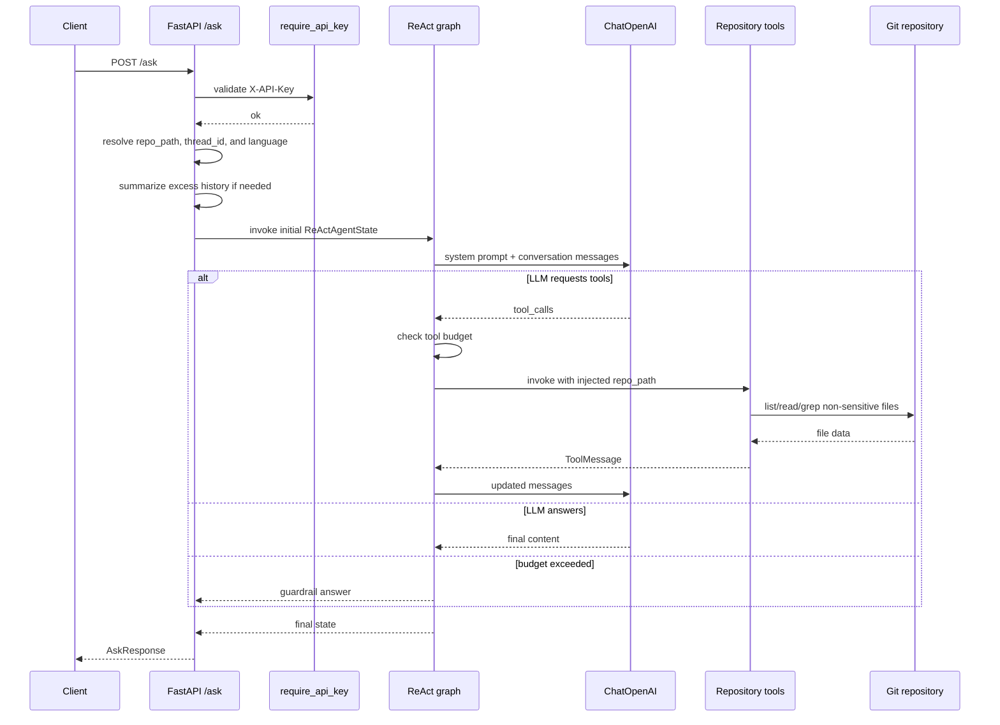
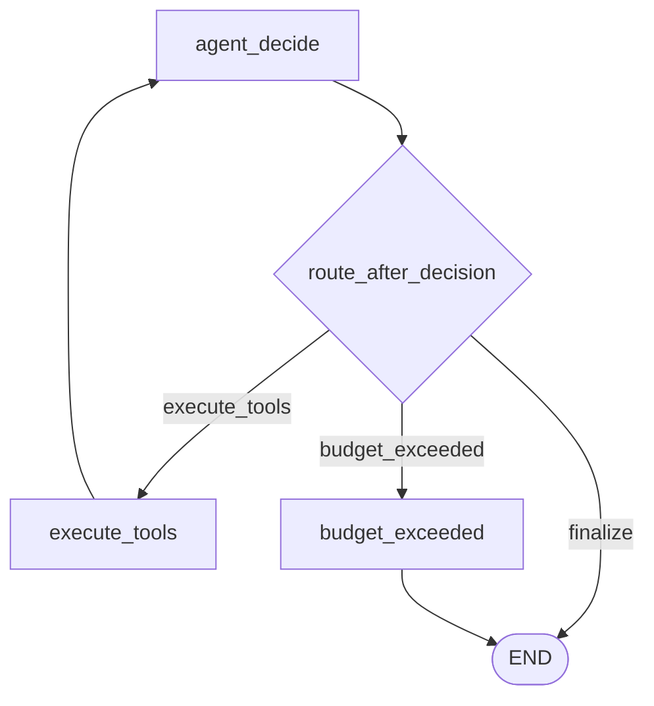

# Architecture

Overture is a small layered FastAPI application around a LangGraph ReAct agent.
It is not a strict Clean Architecture or Hexagonal Architecture implementation:
the API layer composes settings, repository provisioning, graph invocation, and
response mapping directly. The modules are still separated enough to identify
clear responsibilities.

## Components

```mermaid
flowchart LR
    Client[HTTP client]
    FastAPI[app.main FastAPI routes]
    Security[app.security API key dependency]
    Graph[app.graph ReAct graph]
    LLM[OpenAI-compatible chat model]
    AgentTools[app.agent_tools LangChain tool adapters]
    I18n[app.i18n answer language rules]
    RepoTools[app.tools repository tools]
    Semantic[app.semantic_search embedding index]
    Summary[app.summarization rolling summary]
    Repo[Target Git repository]
    Memory[LangGraph in-memory checkpointer]
    Logs[app.observability JSON logs]
    Registry[Curated repo registry]

    Client --> FastAPI
    FastAPI --> Security
    FastAPI --> Registry
    FastAPI --> Memory
    FastAPI --> Graph
    Graph --> LLM
    Graph --> I18n
    Graph --> AgentTools
    AgentTools --> RepoTools
    AgentTools --> Semantic
    RepoTools --> Repo
    Semantic --> Repo
    FastAPI --> Summary
    FastAPI --> Logs
    Graph --> Logs
```

## Module Responsibilities

| Module | Responsibility |
| --- | --- |
| `app.main` | FastAPI app, startup lifecycle, route handlers, request logging, thread and repo selection. |
| `app.retention` | Latest-checkpoint-only in-memory checkpointer and thread retention (idle TTL, LRU cap, in-flight protection). |
| `app.config` | Pydantic settings with `APP_` environment prefix. |
| `app.graph` | ReAct graph, legacy deterministic graph, LLM creation, language-aware prompt/fallbacks, tool execution, budget guardrail. |
| `app.i18n` | Supported answer languages and localized canned responses. |
| `app.agent_tools` | LangChain tool wrappers exposed to the LLM. |
| `app.tools` | Filesystem-safe repository inspection functions. |
| `app.semantic_search` | Optional lazy per-repo embedding index and cosine-similarity search. |
| `app.summarization` | Rolling summary builder for messages removed from thread history. |
| `app.repo` | Default and curated repo materialization by shallow clone or existing path. |
| `app.portfolio` | Optional YAML parsing and `repo_id` validation for curated repos. |
| `app.security` | Static API key dependency. |
| `app.usage` | Process-local rate and concurrency admission, request deadline helpers, and input-budget errors. |
| `app.observability` | Allowlisted JSON log fields, request correlation, private and diagnostic logging. |
| `app.errors` | Stable, content-free error codes and tool recovery messages. |
| `app.schemas` | Pydantic request/response models and trajectory models. |

## Request Lifecycle

```mermaid
sequenceDiagram
    participant C as Client
    participant A as FastAPI /ask
    participant S as require_api_key
    participant G as ReAct graph
    participant L as ChatOpenAI
    participant T as Repository tools
    participant R as Git repository

    C->>A: POST /ask
    A->>S: validate X-API-Key
    S-->>A: ok
    A->>A: resolve repo_path, thread_id, and language
    A->>A: summarize excess history if needed
    A->>G: invoke initial ReActAgentState
    G->>L: system prompt + conversation messages
    alt LLM requests tools
        L-->>G: tool_calls
        G->>G: check tool budget
        G->>T: invoke with injected repo_path
        T->>R: list/read/grep non-sensitive files
        R-->>T: file data
        T-->>G: ToolMessage
        G->>L: updated messages
    else LLM answers
        L-->>G: final content
    else budget exceeded
        G-->>A: guardrail answer
    end
    G-->>A: final state
    A-->>C: AskResponse
```

## ReAct Graph

`build_react_graph()` compiles a `StateGraph` with three nodes:

- `agent_decide`: calls the LLM with tools bound and either records a final answer or stores tool calls in messages.
- `execute_tools`: runs requested tools from `get_tool_registry()`, injects `repo_path`, records `ToolMessage`s and trajectory.
- `budget_exceeded`: stops execution when a requested tool batch would exceed `APP_MAX_ITERATIONS`, closing each rejected call with an error `ToolMessage` and recording the guardrail answer as an `AIMessage`, so the thread stays valid for the next turn.

Edges:

```mermaid
flowchart TD
    A[agent_decide]
    R{route_after_decision}
    E[execute_tools]
    B[budget_exceeded]
    End([END])

    A --> R
    R -->|finalize| End
    R -->|execute_tools| E
    R -->|budget_exceeded| B
    E --> A
    B --> End
```

The prompt instructs the model to read implementation files before answering
behavior questions. `grep_repo` is treated as a locator, not as enough evidence for
behavioral claims.

When `APP_SEMANTIC_SEARCH_ENABLED=true`, the prompt also describes
`semantic_search`. The addendum tells the model to use it only to locate candidate
files when lexical search misses, then call `read_file` to confirm behavior.

Every `/ask` request also adds an answer-language instruction from `app.i18n`.
Supported values are `pt-BR` and `en`; missing values default to `pt-BR`. This
affects the final answer and canned graph fallbacks, but not internal logs or HTTP
error details.

## State

`ReActAgentState` includes:

- `user_input`;
- `repo_path`;
- optional per-request `language`, defaulting to `pt-BR` when absent;
- LangGraph `messages`;
- `final_answer`;
- `outcome`;
- optional `conversation_summary`, supplied as labeled, untrusted context outside the system message when present;
- `trajectory`, reset at the start of each turn so it only holds the current turn;
- cumulative `iterations`;
- optional `turn_start_iterations`, used so the tool budget resets per question even when conversation memory persists.

`app.main.ask` summarizes old thread messages before removing them when history
exceeds `APP_MAX_HISTORY_MESSAGES`. It removes whole turns, cutting only before a
`HumanMessage`, so tool calls stay paired with their results; the transcript keeps
each call's tool name, arguments, and ID next to its result. Tool calls left
unanswered by a crashed request are closed with error results before the next turn. The updated summary is stored in graph state.
If summarization fails, the messages are still removed and the request continues.

## Repository Tools

Tools operate on a target repo path selected by the API layer:

- `list_files(repo_path)`: lists non-sensitive files while skipping ignored directories. The `list_files` tool pages this sorted listing (`offset`, `limit` up to 200 paths, 20,000 characters per response) and ends with the `offset` to continue when more files follow.
- `read_file(repo_path, relative_path, start_line=1, max_lines=300)`: resolves paths inside repo bounds, rejects sensitive/binary/non-file targets and invalid ranges, streams the requested numbered lines (2,000 characters per line, 20,000 per response), and ends with the `start_line` to continue when more lines follow.
- `grep_repo(repo_path, term, max_results=20)`: exact substring search over visible text files, streamed with the same line numbering and per-line cap as `read_file`, truncating matching lines at 200 characters.
- `semantic_search(query, repo_path)`: optional meaning-based lookup over eligible
  files, returning ranked file paths, scores, and 200-character snippets, marking
  files indexed from a prefix only and reporting files left out of the index.

The LLM sees file/search arguments, but not `repo_path`. `repo_path` is an injected
argument in `app.agent_tools` and is added by `execute_tools_node`.

## Semantic Search

Semantic search is off by default. When enabled, `get_llm_tools()` and
`get_tool_registry()` add `semantic_search`.

Implementation characteristics:

- one embedding per file from a streamed prefix (first 300 lines, at most 20,000 characters and 2,000 per line), not chunked function-level embeddings; files cut by that prefix are marked partial;
- admission limits of 1,000 files, 1 MB per file, and 20 MB in total; text files past them are counted as skipped and reported with the results;
- embedding requests sent in batches of 100 files;
- same sensitive-path and binary-file filtering as the other repository tools;
- lazy index build on the first semantic search per `repo_path`;
- process-local cache guarded by locks to avoid duplicate first-use embedding calls;
- cosine similarity ranking with `top_k=3` by default;
- graceful degradation to an empty result if embedding/index/search fails.

## Legacy Deterministic Graph

`build_graph()` remains in `app.graph` for study and regression tests. It classifies
questions into `structural`, `specific_code`, `dependencies`, or `unknown`, then
runs one deterministic repository tool before generating an answer. It is not the
runtime path used by `/ask`.

## Architectural Trade-offs

| Decision | Benefit | Cost |
| --- | --- | --- |
| ReAct loop instead of one-shot retrieval | Lets the model inspect files iteratively and read implementations. | Quality depends on model tool-calling behavior. |
| Feature-flagged `semantic_search` | Helps locate files for conceptual questions with weak lexical overlap. | Adds embedding cost, process-local cache, and provider dependency. |
| Per-request answer language | Lets the frontend switch between `pt-BR` and `en` without separate endpoints or resetting memory. | Internal prompts/errors remain English; unsupported languages are rejected at validation. |
| In-memory checkpointer plus rolling summaries and bounded retention | Keeps follow-ups useful while bounding message history and memory (latest checkpoint per thread, idle TTL, LRU thread cap). | Conversations and embedding indexes disappear on restart, scale-to-zero, expiry, or eviction. |
| Curated repo YAML | Fits portfolio use case and avoids request-time arbitrary URL surface. | Does not satisfy arbitrary repo registration use cases. |
| Static API key plus process-local admission | Bounds admitted `/ask` rate and concurrency before graph execution. | Per-IP identity can group proxy users; multiple instances have independent counters and no shared cost quota. |

## Boundaries and Risks

- The API layer owns repository selection and passes `repo_path` through graph state.
- The graph owns LLM/tool orchestration, not HTTP status mapping.
- Tool functions own filesystem guardrails.
- There is no persistent database, queue, tracing backend, or metrics backend.
- Semantic indexes are in-memory only and are rebuilt after process restart.
- A thread is bound to its first repository; a request for another repository returns `409` until the thread expires or is evicted.
